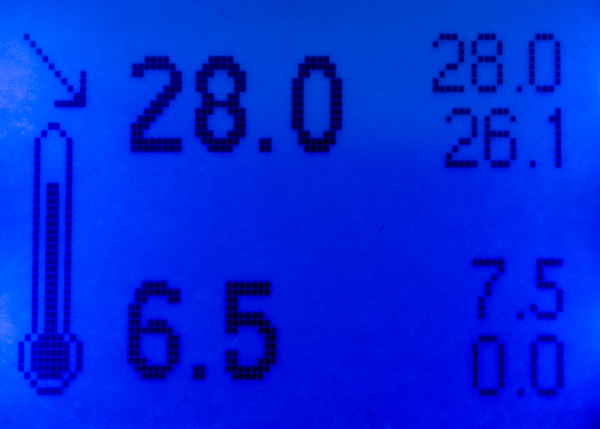
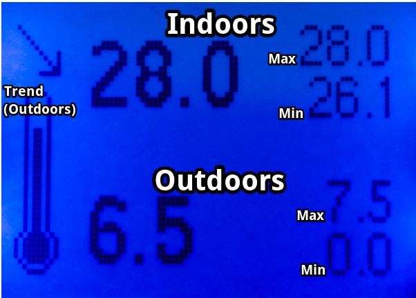
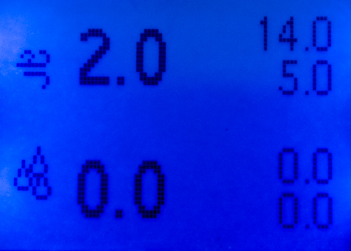
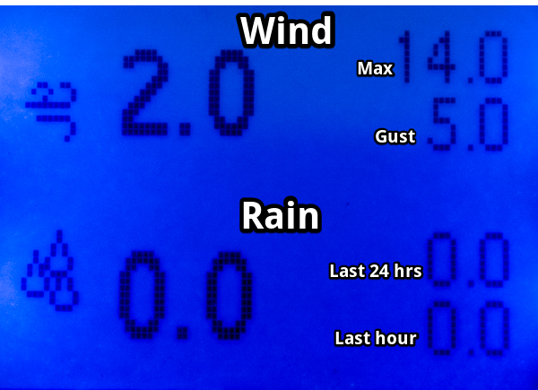

Display netatmo data on arduino/5110 screen

## script

Python code to run on a web server - this just fetches the info and does some json parsing.
Install it with cron and redirect output to a static file for serving over http

It requires the following four variables in secrets.json (see secrets_sample.json for the format):

* CLIENT_ID = netatmo app client id
* CLIENT_SECRET = netatmo app client secret
* USERNAME = netatmo account username
* PASSWORD = netatmo account password

To create an app - see https://dev.netatmo.com/dev/createanapp

### Development

mkvirtualenv -p $(which python3) netatmo
workon netatmo
pip install -r requirements.txt

## arduino

The arduino script needs a host and path to the file created by the python script and also a wifi SSID and password.

### Screenshots

#### Temperature

#### Wind and Rain

